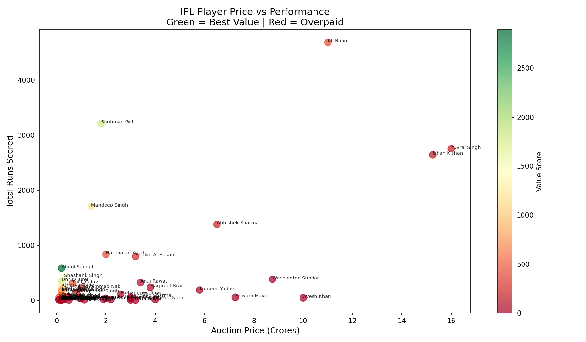
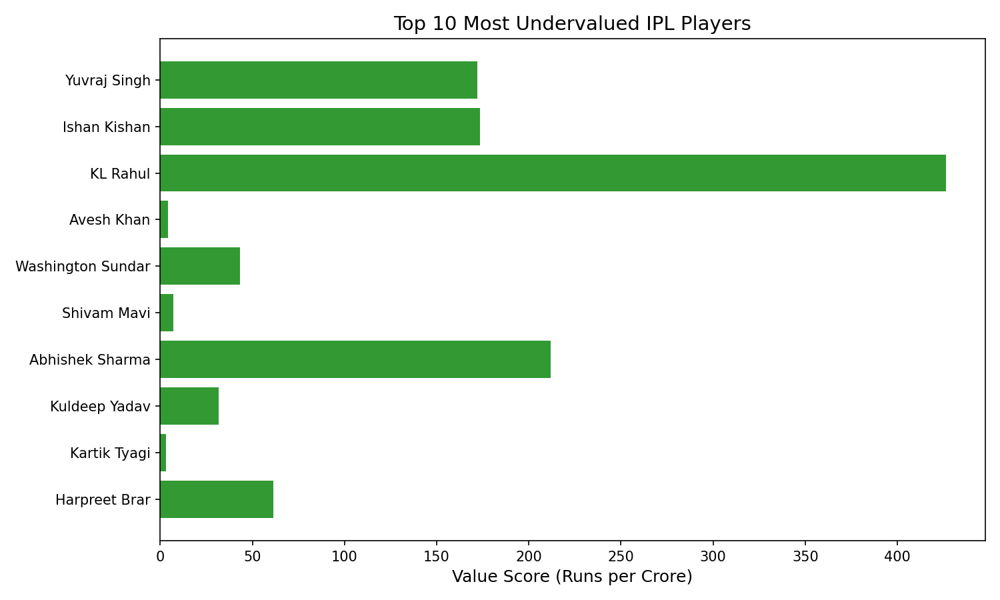
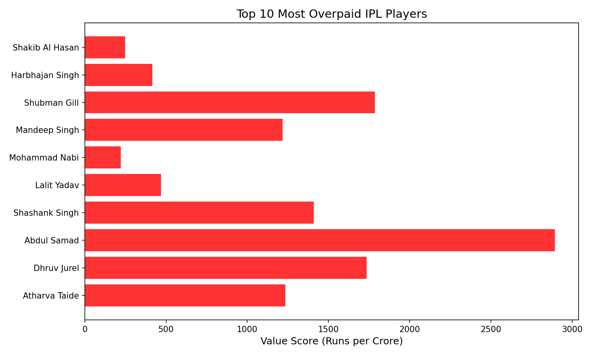

# ipl-auction-analysis
Analyzing IPL player auction prices vs performance to find the most undervalued and overpaid players using Python and Tableau.

# IPL Player Auction Value Analysis

## Business Problem
IPL franchises spend hundreds of crores in auctions every year — 
but are they buying the right players?

## What I Found
- Abdul Samad and Shubman Gill delivered the best runs-per-crore value
- High-price players like Yuvraj Singh and Avesh Khan significantly 
  underdelivered relative to their auction price
- Teams overspending on marquee names saw poor value returns

## Recommendation
Franchises should prioritize players under ₹5 crore with consistent 
performance history over big names with declining stats

## Charts

## Tools Used
- Python (pandas, matplotlib, seaborn)
- Anaconda / Jupyter Notebook
- Data: IPL Complete Dataset — Kaggle
